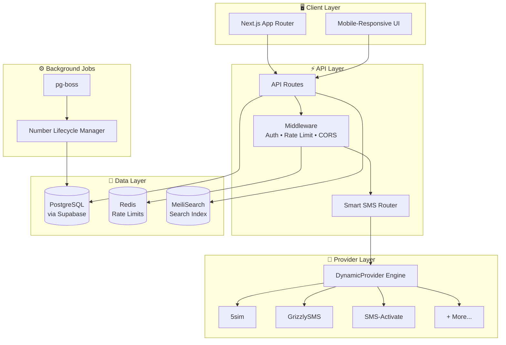
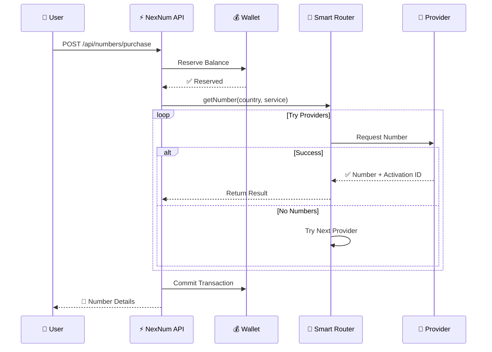
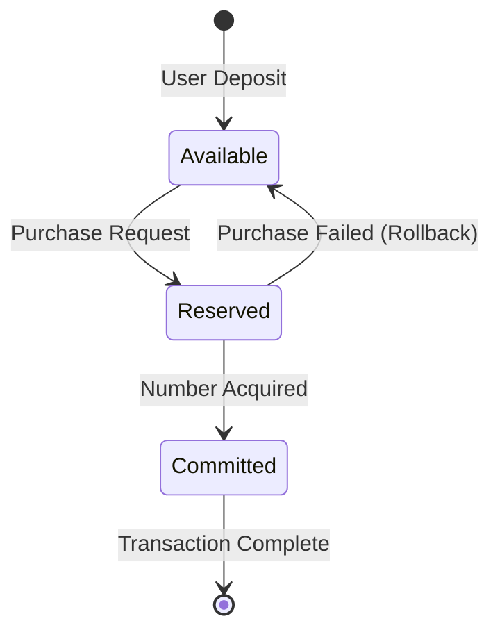
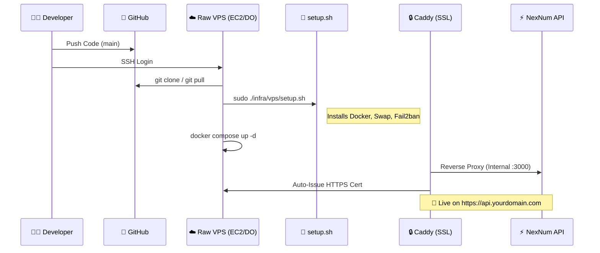

<div align="center">

<!-- � Animated Header -->


<!-- ⭐ Status Badges -->
<p>


</p>

<!-- 🔗 Tech Badges -->
<p>


</p>

<!-- 📊 Repo Stats -->
<p>


</p>

<!-- 🚀 Quick Actions -->
<p>
<a href="#-quick-start"></a>
<a href="nexnum-app/docs/api-reference.md"></a>
<a href="nexnum-app/docs/deployment.md"></a>
<a href="#-documentation"></a>
</p>

<br/>

<!-- ✨ Tagline -->
**🔥 Enterprise SMS Verification • ⚡ Multi-Provider Smart Routing • 🛡️ Circuit Breaker Resilience**

</div>

<!-- 🌊 Animated Divider -->


---

## 📋 Table of Contents

- [✨ Features](#-features)
- [🏗️ Architecture](#️-architecture)
- [🛠️ Tech Stack](#️-tech-stack)
- [📁 Project Structure](#-project-structure)
- [🚀 Quick Start](#-quick-start)
- [📊 System Overview](#-system-overview)
- [🔌 Provider Integration](#-provider-integration)
- [💳 Wallet System](#-wallet-system)
- [🎨 Design System](#-design-system)
- [📈 Monitoring](#-monitoring)
- [☁️ Production Deployment](#-production-deployment-vps--ec2)
- [🔒 Security](#-security)
- [📚 Documentation](#-documentation)
- [📄 License](#-license)

---

## ✨ Features

<table>
<tr>
<td width="50%">

### 🎯 Core Capabilities

| Feature | Description |
|---------|-------------|
| 🔢 **Virtual Numbers** | Rent temporary phone numbers for SMS verification |
| 🌍 **Global Coverage** | 100+ countries with dynamic provider switching |
| ⚡ **Smart Routing** | Automatic failover across multiple providers |
| 🔄 **Real-time Updates** | Webhook-based instant SMS delivery |
| 💰 **Wallet System** | Secure balance management with reservations |

</td>
<td width="50%">

### 🛡️ Enterprise Features

| Feature | Description |
|---------|-------------|
| 🔐 **JWT Auth** | Secure authentication with refresh tokens |
| ⚙️ **Rate Limiting** | Redis-backed request throttling |
| 📊 **Prometheus Metrics** | Full observability stack |
| 🔌 **Dynamic Providers** | Add providers via JSON config, no code |
| 🤖 **AI Config Assistant** | Gemini-powered provider setup |

</td>
</tr>
</table>

---

## 🏗️ Architecture



---

## 🛠️ Tech Stack

<div align="center">

<!-- 🎨 Visual Icons Grid -->
<table>
<tr>
<td align="center" width="96">

<br><sub><b>Next.js 16</b></sub>
</td>
<td align="center" width="96">

<br><sub><b>React 19</b></sub>
</td>
<td align="center" width="96">

<br><sub><b>TypeScript</b></sub>
</td>
<td align="center" width="96">

<br><sub><b>Tailwind 4</b></sub>
</td>
<td align="center" width="96">

<br><sub><b>Prisma 6</b></sub>
</td>
<td align="center" width="96">

<br><sub><b>PostgreSQL</b></sub>
</td>
</tr>
<tr>
<td align="center" width="96">

<br><sub><b>Redis</b></sub>
</td>
<td align="center" width="96">

<br><sub><b>Docker</b></sub>
</td>
<td align="center" width="96">

<br><sub><b>AWS EC2</b></sub>
</td>
<td align="center" width="96">

<br><sub><b>Prometheus</b></sub>
</td>
<td align="center" width="96">

<br><sub><b>Sentry</b></sub>
</td>
<td align="center" width="96">

<br><sub><b>GitHub CI</b></sub>
</td>
</tr>
</table>

</div>

---

## 📁 Project Structure

<details open>
<summary><b>🗂️ Complete Directory Tree</b></summary>

```
nexnum-app/
├── 📂 prisma/
│   └── schema.prisma              # 🗃️ Database schema (PostgreSQL)
│
├── 📂 public/                     # 🖼️ Static assets
│
├── 📂 src/
│   ├── 📂 app/                    # ⚡ Next.js App Router
│   │   ├── 📂 admin/              # 🛡️ Admin dashboard pages
│   │   │   ├── inventory/         #    └─ Inventory management
│   │   │   ├── providers/         #    └─ Provider configuration
│   │   │   ├── settings/          #    └─ System settings
│   │   │   └── users/             #    └─ User management
│   │   │
│   │   ├── 📂 api/                # 🔌 API Routes
│   │   │   ├── admin/             #    └─ Admin endpoints
│   │   │   │   ├── ai-generate/   #        └─ AI config generator
│   │   │   │   ├── analytics/     #        └─ Dashboard analytics
│   │   │   │   ├── providers/     #        └─ Provider CRUD & sync
│   │   │   │   ├── settings/      #        └─ System configuration
│   │   │   │   └── users/         #        └─ User management
│   │   │   ├── auth/              #    └─ Authentication (login/register/refresh)
│   │   │   ├── cron/              #    └─ Scheduled job triggers
│   │   │   ├── health/            #    └─ Health check endpoints
│   │   │   ├── metrics/           #    └─ Prometheus metrics
│   │   │   ├── numbers/           #    └─ Number operations
│   │   │   │   ├── purchase/      #        └─ Buy virtual number
│   │   │   │   ├── cancel/        #        └─ Cancel activation
│   │   │   │   └── status/        #        └─ Check SMS status
│   │   │   ├── search/            #    └─ MeiliSearch integration
│   │   │   ├── wallet/            #    └─ Wallet operations
│   │   │   └── webhooks/          #    └─ Incoming SMS webhooks
│   │   │
│   │   ├── 📂 dashboard/          # 👤 User dashboard pages
│   │   │   ├── buy/               #    └─ Purchase flow
│   │   │   ├── history/           #    └─ Transaction history
│   │   │   ├── vault/             #    └─ Active numbers
│   │   │   └── wallet/            #    └─ Balance & deposits
│   │   │
│   │   ├── 📂 login/              # 🔐 Auth pages
│   │   ├── 📂 register/
│   │   ├── globals.css            # 🎨 Global styles & CSS vars
│   │   ├── layout.tsx             # 📄 Root layout
│   │   └── page.tsx               # 🏠 Landing page
│   │
│   ├── 📂 components/             # 🧩 React Components
│   │   ├── 📂 admin/              # 🛡️ Admin UI components
│   │   │   ├── AdminBackground    #    └─ Dashboard background
│   │   │   ├── AIConfigAssistant  #    └─ AI provider setup wizard
│   │   │   └── ProviderAIHub      #    └─ AI optimization panel
│   │   ├── 📂 auth/               # 🔐 Auth forms
│   │   ├── 📂 common/             # 🔧 Shared components
│   │   ├── 📂 home/               # 🏠 Landing page sections
│   │   │   ├── Hero               #    └─ Hero section
│   │   │   ├── Features           #    └─ Feature cards
│   │   │   ├── Pricing            #    └─ Pricing tiers
│   │   │   └── FAQ                #    └─ FAQ accordion
│   │   ├── 📂 layout/             # 📐 Layout components
│   │   │   ├── Navbar             #    └─ Navigation bar
│   │   │   └── Footer             #    └─ Site footer
│   │   └── 📂 ui/                 # 🎨 UI primitives (Button, Input, etc.)
│   │
│   ├── 📂 lib/                    # 📚 Core Business Logic
│   │   ├── 🔧 Core Services
│   │   │   ├── db.ts              #    └─ Prisma client
│   │   │   ├── redis.ts           #    └─ Redis connection
│   │   │   ├── logger.ts          #    └─ Structured logging
│   │   │   └── cache.ts           #    └─ SWR caching layer
│   │   │
│   │   ├── 🔐 Auth & Security
│   │   │   ├── auth.ts            #    └─ Session management
│   │   │   ├── jwt.ts             #    └─ Token generation
│   │   │   ├── ratelimit.ts       #    └─ Request throttling
│   │   │   └── validation.ts      #    └─ Input validation (Zod)
│   │   │
│   │   ├── 📱 SMS Provider Engine
│   │   │   ├── dynamic-provider.ts    #    └─ Universal provider adapter
│   │   │   ├── smart-router.ts        #    └─ Multi-provider routing
│   │   │   ├── provider-factory.ts    #    └─ Provider instantiation
│   │   │   └── provider-sync.ts       #    └─ Country/service sync
│   │   │
│   │   ├── 📂 sms-providers/      # 🔌 Provider implementations
│   │   │   ├── types.ts           #    └─ SmsProvider interface
│   │   │   └── fivesim.ts         #    └─ 5sim reference implementation
│   │   │
│   │   ├── 💰 Wallet & Transactions
│   │   │   ├── wallet.ts          #    └─ Balance operations
│   │   │   └── reservation-cleanup.ts └─ Expired reservation cleanup
│   │   │
│   │   ├── ⚙️ Background Jobs
│   │   │   ├── number-lifecycle-manager.ts  # └─ pg-boss job processor
│   │   │   └── activation-service.ts        # └─ Activation state machine
│   │   │
│   │   ├── 🔍 Search & Discovery
│   │   │   ├── search.ts          #    └─ MeiliSearch client
│   │   │   ├── country-normalizer.ts  #    └─ Country name mapping
│   │   │   └── service-normalizer.ts  #    └─ Service code mapping
│   │   │
│   │   ├── 🤖 AI Integration
│   │   │   └── gemini-pool.ts     #    └─ Gemini API key rotation
│   │   │
│   │   └── 📊 Observability
│   │       └── metrics.ts         #    └─ Prometheus counters/gauges
│   │
│   ├── 📂 hooks/                  # 🪝 React Hooks
│   ├── 📂 stores/                 # 🗄️ Zustand state stores
│   ├── 📂 types/                  # 📝 TypeScript types
│   ├── middleware.ts              # 🛡️ Edge middleware (auth, rate limit)
│   └── instrumentation.ts         # 📡 Sentry & pg-boss init
│
├── 📄 .env                        # 🔒 Environment variables
├── 📄 Dockerfile                  # 🐳 Container build (optional)
├── 📄 docker-compose.yml          # 🐳 Local development stack
├── 📄 package.json                # 📦 Dependencies
└── 📄 tsconfig.json               # ⚙️ TypeScript config
```

</details>

---

## 🚀 Quick Start

```bash
# 1️⃣ Clone the repository
git clone https://github.com/FlashTheFire/NexNum.git
cd NexNum/nexnum-app

# 2️⃣ Install dependencies
npm install

# 3️⃣ Setup environment variables
cp .env.example .env
# Edit .env with your database URL, API keys, etc.

# 4️⃣ Generate Prisma client & push schema
npx prisma generate
npx prisma db push

# 5️⃣ Start development server (Turbopack)
npm run dev
```

<details>
<summary>📦 <b>Production Build</b></summary>

```bash
# Build optimized production bundle
npm run build

# Start production server
npm start
```

</details>

<details>
<summary>🐳 <b>Docker Deployment</b></summary>

```bash
# Build Docker image
docker build -t nexnum-app .

# Run container
docker run -p 3000:3000 --env-file .env nexnum-app
```

</details>

---

## 📊 System Overview



---

## 🔌 Provider Integration

### Dynamic Provider Engine

NexNum uses a **code-free provider integration** system. Add any SMS provider with just JSON configuration:

```json
{
  "name": "my-provider",
  "apiBaseUrl": "https://api.provider.com/v1",
  "authType": "query_param",
  "authQueryParam": "api_key",
  
  "endpoints": {
    "getNumber": {
      "method": "GET",
      "path": "/buy",
      "queryParams": {
        "country": "$country",
        "service": "$service"
      }
    }
  },
  
  "mappings": {
    "getNumber": {
      "type": "text_regex",
      "regex": "ACCESS_NUMBER:(?<id>\\d+):(?<phone>\\d+)",
      "fields": {
        "activationId": "id",
        "phoneNumber": "phone"
      },
      "errors": {
        "patterns": {
          "NO_NUMBERS": "NO_NUMBERS",
          "NO_BALANCE": "not enough balance"
        }
      }
    }
  }
}
```

### 🤖 AI-Powered Configuration

Use the **Gemini AI Assistant** to auto-generate provider configs from API documentation:

| Mode | Description |
|------|-------------|
| 🧠 **Optimization** | Analyze full docs, fill missing endpoints |
| ⚡ **Endpoint** | Generate single endpoint config |
| 🐛 **Debugger** | Fix broken mappings from error traces |

---

## 💳 Wallet System



| Transaction Type | Description |
|-----------------|-------------|
| `DEPOSIT` | Add funds via payment gateway |
| `PURCHASE` | Deduct for number rental |
| `REFUND` | Return unused reservation |
| `PENALTY` | Anti-fraud deduction |

---

## 🎨 Design System

<table>
<tr>
<td>

### 🎨 Color Palette

| Color | Hex | Usage |
|-------|-----|-------|
| ⚫ **Charcoal** | `#101012` | Background |
| 🟢 **Neon Lime** | `#C6FF00` | Primary accent |
| 🔵 **Deep Teal** | `#0F2E2E` | Gradients |
| ⚪ **Frost** | `#FFFFFF10` | Glass effects |

</td>
<td>

### ✨ Visual Effects

- 🌫️ **Glassmorphism** - Frosted glass cards
- 🌀 **Radial Gradients** - Atmospheric depth
- 📽️ **Cinematic Vignette** - Focus attention
- 🔮 **Micro-animations** - Premium feel

</td>
</tr>
</table>

---

## 📈 Monitoring & Admin Dashboards

<div align="center">

### 🖥️ Admin Dashboard Features

</div>

<table>
<tr>
<td width="50%" valign="top">

#### 📊 Real-Time Analytics
- 📈 **Live Charts** — SMS usage, revenue trends
- 🌍 **Global Map** — Provider coverage visualization
- ⚡ **Active Numbers** — Real-time rental tracking
- 💰 **Revenue Metrics** — Daily/weekly/monthly stats

</td>
<td width="50%" valign="top">

#### 🛠️ Management Tools
- 👥 **User Management** — Ban, verify, adjust balance
- 🔌 **Provider Control** — Enable/disable, sync data
- ⚙️ **System Settings** — Margins, limits, features
- 🔍 **Inventory Search** — MeiliSearch-powered

</td>
</tr>
</table>

---

### 📡 Prometheus Metrics

<div align="center">

| Metric | Type | Description |
|:-------|:----:|:------------|
| `nexnum_http_requests_total` | 📊 Counter | Total HTTP requests by endpoint |
| `nexnum_provider_requests_total` | 📊 Counter | Provider API calls by provider |
| `nexnum_wallet_transactions_total` | 📊 Counter | Wallet operations by type |
| `nexnum_active_numbers` | 📈 Gauge | Currently active rentals |
| `nexnum_provider_latency` | 📉 Histogram | Provider response times (P50/P95/P99) |

</div>

---

### 🏥 Health Endpoints

```bash
GET /api/health          # ✅ Basic health check (for load balancers)
GET /api/health/ready    # ✅ Readiness probe (DB + Redis connected)
GET /api/health/detailed # 📊 Full system status (admin only)
GET /api/metrics         # 📈 Prometheus metrics endpoint
```

---

### 🔔 Alerting (CloudWatch)

| Alert | Trigger | Action |
|:------|:--------|:-------|
| 🔴 **High Error Rate** | >1% errors in 5min | SNS notification |
| 🟠 **High Latency** | P99 >5s for 3 periods | Scale up / investigate |
| 🟡 **Low Balance** | Provider balance <$10 | Email admin |

---

## ☁️ Production Deployment (VPS / EC2)

The recommended **"Senior Level"** deployment method for cost efficiency and control. Uses the `infra/vps` GitOps workflow.

### 🗺️ The "GitOps Lite" Workflow



### 🚀 Easy Deploy Guide (3 Steps)

We have automated the boring stuff.

#### 1. Provision Server
Launch a **Ubuntu 22.04 LTS** instance (AWS `t3.micro` or DigitalOcean Droplet).
- Open Ports: `22` (SSH), `80` (HTTP), `443` (HTTPS).
- **Do NOT** open port 3000.

#### 2. Initialize (One-Time)
SSH into your fresh server and run our magic script:

```bash
# Clone the repo
git clone https://github.com/FlashTheFire/NexNum.git
cd NexNum/nexnum-app

# Run the setup wizard (Creates Swap, Installs Docker)
sudo ./infra/vps/setup.sh
```

#### 3. Go Live
Config your environment and launch:

```bash
# Set secrets
cp .env.example .env.production
nano .env.production

# Launch with Auto-SSL
DOMAIN_NAME=api.your-domain.com ./infra/vps/deploy.sh localhost
```

### 💾 Cost optimized Stack (Free Tier Compatible)

```
┌─────────────────────────────────────────────────────────┐
│              NexNum "Smart Startup" Stack               │
├─────────────────────────────────────────────────────────┤
│  ☁️  VPS/EC2        → AWS Free Tier (t2/t3.micro) ($0)  │
│  🗃️  Supabase       → PostgreSQL Database         (FREE)│
│  ⚡  Redis          → Self-Hosted (Docker)        (FREE)│
│  🔒  Caddy          → Auto-HTTPS / SSL            (FREE)│
├─────────────────────────────────────────────────────────┤
│  💰 TOTAL: $0/month (for 12 months)                     │
│  ⚠️ Limits: 750hrs instance, 100GB bandwidth, 30GB SSD  │
└─────────────────────────────────────────────────────────┘
```

---

## 🔒 Security

- ✅ **JWT Authentication** with HTTP-only refresh tokens
- ✅ **Rate Limiting** - Redis-backed request throttling
- ✅ **CORS Protection** - Configurable origins
- ✅ **CSP Headers** - Content Security Policy
- ✅ **Input Validation** - Zod schema validation
- ✅ **SQL Injection Protection** - Prisma ORM

---

## 📚 Documentation

<div align="center">

### 📖 Knowledge Base

*Everything you need to build, deploy, and scale NexNum*

</div>

<table>
<tr>
<td width="50%">

#### 🏗️ Architecture & Theory
| Doc | Description |
|-----|-------------|
| [🏗️ Architecture](nexnum-app/docs/architecture.md) | System design & data flow |
| [🔌 API Reference](nexnum-app/docs/api-reference.md) | Standard envelope & endpoints |
| [🔒 Security](nexnum-app/docs/security.md) | Auth, Audit & Secrets |

</td>
<td width="50%">

#### 🚀 Operations & Cloud
| Doc | Description |
|-----|-------------|
| [☁️ Deployment](nexnum-app/docs/deployment.md) | VPS/EC2 Production Guide |
| [⚙️ Operations](nexnum-app/docs/operations.md) | Backups & Incident Response |
| [📝 Env Reference](nexnum-app/docs/env-reference.md) | Full config dictionary |

</td>
</tr>
<tr>
<td width="50%">

#### 🤝 Open Source
| Doc | Description |
|-----|-------------|
| [🤝 Contributing](nexnum-app/CONTRIBUTING.md) | Setup & PR process |
| [📝 Changelog](nexnum-app/CHANGELOG.md) | Version history |
| [👮 Code Owners](nexnum-app/CODEOWNERS) | Team ownership |

</td>
<td width="50%">

#### 📚 Full Index
| Doc | Description |
|-----|-------------|
| [📖 Docs Index](nexnum-app/docs/README.md) | Master documentation hub |

</td>
</tr>
</table>

<details>
<summary><b>📁 Configuration Files</b></summary>

Central configuration lives in `nexnum-app/src/config/`:

| File | Purpose |
|------|---------|
| `app.config.ts` | Limits, timeouts, workers, features |
| `providers.config.ts` | SMS provider settings |
| `env.schema.ts` | Zod validation for all env vars |

</details>

---

## 📄 License

<div align="center">

<!-- 🌊 Footer Wave -->


<br/>

**MIT License** © 2024-2026 NexNum

<br/>

Built with 💚 by [**FlashTheFire**](https://github.com/FlashTheFire)

<br/>

<!-- 🔗 Social Links -->
<a href="https://github.com/FlashTheFire/NexNum">

</a>
<a href="https://github.com/FlashTheFire/NexNum/fork">

</a>
<a href="https://github.com/FlashTheFire">

</a>

<br/><br/>

<sub>🚀 If NexNum helps you, consider giving it a ⭐ — it means a lot!</sub>

</div>
