<div align="center">

# 🌐 NexNum

### Next-Generation Virtual Number & SMS Verification Platform

[](https://nextjs.org/)
[](https://react.dev)
[](https://www.typescriptlang.org/)
[](https://www.prisma.io/)
[](https://supabase.com/)

[](LICENSE)
[](http://makeapullrequest.com)
[](https://github.com/FlashTheFire/NexNum/graphs/commit-activity)

<br/>


**🔥 Enterprise-Grade SMS Verification • ⚡ Multi-Provider Smart Routing • 🛡️ Circuit Breaker Resilience**

</div>

---

## 📋 Table of Contents

- [✨ Features](#-features)
- [🏗️ Architecture](#️-architecture)
- [🛠️ Tech Stack](#️-tech-stack)
- [🚀 Quick Start](#-quick-start)
- [📊 System Overview](#-system-overview)
- [🔌 Provider Integration](#-provider-integration)
- [💳 Wallet System](#-wallet-system)
- [🎨 Design System](#-design-system)
- [📈 Monitoring](#-monitoring)
- [📄 License](#-license)

---

## ✨ Features

<table>
<tr>
<td width="50%">

### 🎯 Core Capabilities

| Feature | Description |
|---------|-------------|
| 🔢 **Virtual Numbers** | Rent temporary phone numbers for SMS verification |
| 🌍 **Global Coverage** | 100+ countries with dynamic provider switching |
| ⚡ **Smart Routing** | Automatic failover across multiple providers |
| 🔄 **Real-time Updates** | Webhook-based instant SMS delivery |
| 💰 **Wallet System** | Secure balance management with reservations |

</td>
<td width="50%">

### 🛡️ Enterprise Features

| Feature | Description |
|---------|-------------|
| 🔐 **JWT Auth** | Secure authentication with refresh tokens |
| ⚙️ **Rate Limiting** | Redis-backed request throttling |
| 📊 **Prometheus Metrics** | Full observability stack |
| 🔌 **Dynamic Providers** | Add providers via JSON config, no code |
| 🤖 **AI Config Assistant** | Gemini-powered provider setup |

</td>
</tr>
</table>

---

## 🏗️ Architecture

```mermaid
flowchart TB
    subgraph Client["🖥️ Client Layer"]
        WEB["Next.js App Router"]
        MOBILE["Mobile-Responsive UI"]
    end
    
    subgraph API["⚡ API Layer"]
        ROUTES["API Routes"]
        MW["Middleware<br/>Auth • Rate Limit • CORS"]
        ROUTER["Smart SMS Router"]
    end
    
    subgraph Providers["🔌 Provider Layer"]
        DP["DynamicProvider Engine"]
        P1["5sim"]
        P2["GrizzlySMS"]
        P3["SMS-Activate"]
        MORE["+ More..."]
    end
    
    subgraph Data["💾 Data Layer"]
        DB[(PostgreSQL<br/>via Supabase)]
        REDIS[(Redis<br/>Rate Limits)]
        MEILISEARCH[(MeiliSearch<br/>Search Index)]
    end
    
    subgraph Jobs["⚙️ Background Jobs"]
        BOSS["pg-boss"]
        LIFECYCLE["Number Lifecycle Manager"]
    end
    
    WEB --> ROUTES
    MOBILE --> ROUTES
    ROUTES --> MW --> ROUTER
    ROUTER --> DP
    DP --> P1 & P2 & P3 & MORE
    ROUTES --> DB
    MW --> REDIS
    ROUTES --> MEILISEARCH
    LIFECYCLE --> DB
    BOSS --> LIFECYCLE
```



---

## 🛠️ Tech Stack

<div align="center">

### Frontend


### Backend


### DevOps & Monitoring


</div>

---

## 🚀 Quick Start

```bash
# 1️⃣ Clone the repository
git clone https://github.com/FlashTheFire/NexNum.git
cd NexNum/nexnum-app

# 2️⃣ Install dependencies
npm install

# 3️⃣ Setup environment variables
cp .env.example .env
# Edit .env with your database URL, API keys, etc.

# 4️⃣ Generate Prisma client & push schema
npx prisma generate
npx prisma db push

# 5️⃣ Start development server (Turbopack)
npm run dev
```

<details>
<summary>📦 <b>Production Build</b></summary>

```bash
# Build optimized production bundle
npm run build

# Start production server
npm start
```

</details>

<details>
<summary>🐳 <b>Docker Deployment</b></summary>

```bash
# Build Docker image
docker build -t nexnum-app .

# Run container
docker run -p 3000:3000 --env-file .env nexnum-app
```

</details>

---

## 📊 System Overview

```mermaid
sequenceDiagram
    participant U as 👤 User
    participant API as ⚡ NexNum API
    participant W as 💰 Wallet
    participant R as 🔀 Smart Router
    participant P as 🔌 Provider

    U->>API: POST /api/numbers/purchase
    API->>W: Reserve Balance
    W-->>API: ✅ Reserved
    API->>R: getNumber(country, service)
    
    loop Try Providers
        R->>P: Request Number
        alt Success
            P-->>R: ✅ Number + Activation ID
            R-->>API: Return Result
        else No Numbers
            R->>R: Try Next Provider
        end
    end
    
    API->>W: Commit Transaction
    API-->>U: 📱 Number Details
```



---

## 🔌 Provider Integration

### Dynamic Provider Engine

NexNum uses a **code-free provider integration** system. Add any SMS provider with just JSON configuration:

```json
{
  "name": "my-provider",
  "apiBaseUrl": "https://api.provider.com/v1",
  "authType": "query_param",
  "authQueryParam": "api_key",
  
  "endpoints": {
    "getNumber": {
      "method": "GET",
      "path": "/buy",
      "queryParams": {
        "country": "$country",
        "service": "$service"
      }
    }
  },
  
  "mappings": {
    "getNumber": {
      "type": "text_regex",
      "regex": "ACCESS_NUMBER:(?<id>\\d+):(?<phone>\\d+)",
      "fields": {
        "activationId": "id",
        "phoneNumber": "phone"
      },
      "errors": {
        "patterns": {
          "NO_NUMBERS": "NO_NUMBERS",
          "NO_BALANCE": "not enough balance"
        }
      }
    }
  }
}
```

### 🤖 AI-Powered Configuration

Use the **Gemini AI Assistant** to auto-generate provider configs from API documentation:

| Mode | Description |
|------|-------------|
| 🧠 **Optimization** | Analyze full docs, fill missing endpoints |
| ⚡ **Endpoint** | Generate single endpoint config |
| 🐛 **Debugger** | Fix broken mappings from error traces |

---

## 💳 Wallet System


| Transaction Type | Description |
|-----------------|-------------|
| `DEPOSIT` | Add funds via payment gateway |
| `PURCHASE` | Deduct for number rental |
| `REFUND` | Return unused reservation |
| `PENALTY` | Anti-fraud deduction |

---

## 🎨 Design System

<table>
<tr>
<td>

### 🎨 Color Palette

| Color | Hex | Usage |
|-------|-----|-------|
| ⚫ **Charcoal** | `#101012` | Background |
| 🟢 **Neon Lime** | `#C6FF00` | Primary accent |
| 🔵 **Deep Teal** | `#0F2E2E` | Gradients |
| ⚪ **Frost** | `#FFFFFF10` | Glass effects |

</td>
<td>

### ✨ Visual Effects

- 🌫️ **Glassmorphism** - Frosted glass cards
- 🌀 **Radial Gradients** - Atmospheric depth
- 📽️ **Cinematic Vignette** - Focus attention
- 🔮 **Micro-animations** - Premium feel

</td>
</tr>
</table>

---

## 📈 Monitoring

### Prometheus Metrics

| Metric | Type | Description |
|--------|------|-------------|
| `nexnum_http_requests_total` | Counter | Total HTTP requests |
| `nexnum_provider_requests_total` | Counter | Provider API calls |
| `nexnum_wallet_transactions_total` | Counter | Wallet operations |
| `nexnum_active_numbers` | Gauge | Currently active rentals |
| `nexnum_provider_latency` | Histogram | Provider response times |

### Health Endpoints

```
GET /api/health          → Basic health check
GET /api/health/detailed → Full system status
GET /api/metrics         → Prometheus metrics
```

---

## 🔒 Security

- ✅ **JWT Authentication** with HTTP-only refresh tokens
- ✅ **Rate Limiting** - Redis-backed request throttling
- ✅ **CORS Protection** - Configurable origins
- ✅ **CSP Headers** - Content Security Policy
- ✅ **Input Validation** - Zod schema validation
- ✅ **SQL Injection Protection** - Prisma ORM

---

## 📄 License

<div align="center">

**MIT License** © 2024-2026 NexNum

Made with ❤️ by **FlashTheFire**

[](https://github.com/FlashTheFire)


**⭐ Star this repo if you find it useful!**

</div>
