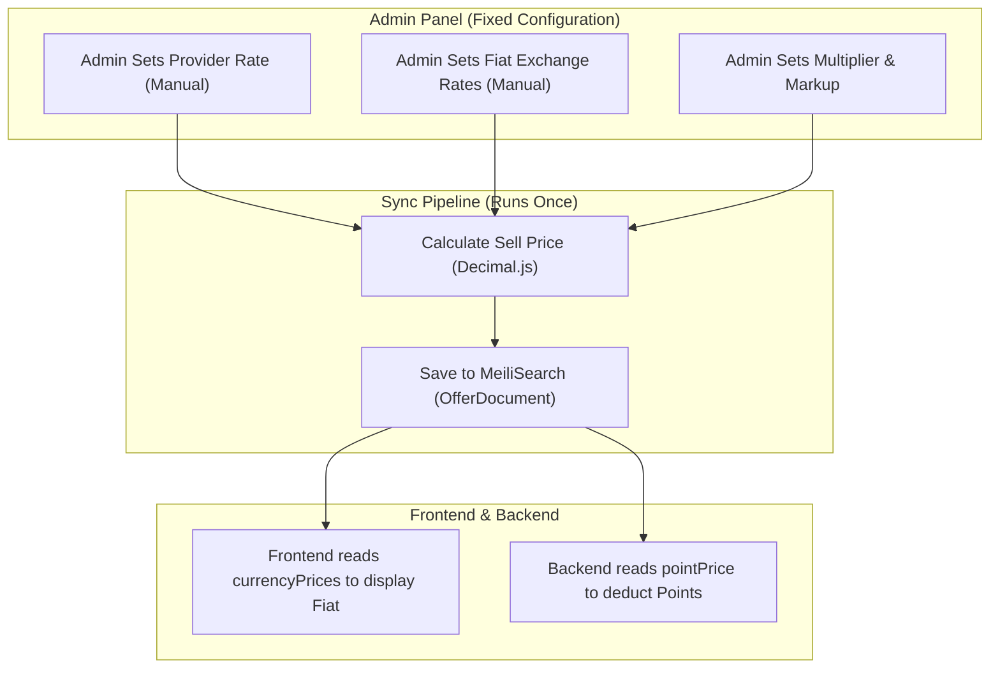

# NexNum Financial System — Forensic Audit & Migration Roadmap (Final)

> **Scope**: Complete audit of wallet, points, currency conversion, deposit, deduction, reservation, refund, and transaction flows.  
> **Auditor**: Antigravity Deep Audit Engine  
> **Date**: 2026-04-30  
> **Status**: 🔍 Review Required — Awaiting Final Approval

---

## Executive Summary

NexNum operates a **Points-Based Internal Ledger**. The backend strictly uses **Points** for all internal operations. Exchange rates exist **only** to provide a converted display map for the frontend. 

Based on your explicit directives, the system architecture will enforce:
1. **Fixed Pricing via Admin Panel**: Zero external API calls (no Frankfurter). All currency exchange rates are set manually by the admin. No random fluctuations.
2. **Pre-Calculated Pricing**: All heavy lifting (Multiplier + Markup + Spread) happens *once* during indexing. The backend simply reads the saved `pointPrice` and `currencyPrices` from MeiliSearch.
3. **Unified Codebase**: A single, robust `CurrencyService` using precise `Decimal.js` math to generate the frontend display maps.

---

## 1. Resolution of Open Questions (Final Directives)

### A1: PriceEngine & MeiliSearch Data Handling
**Your Directive**: Fold the calculation logic together. Instead of constantly calculating or reverse-calculating raw prices, the backend must get the price from the saved data.
**Confirmed**: You are 100% right. During the provider sync, we will run the calculation (Raw Cost × Multiplier + Markup) *once*. The result is saved directly into MeiliSearch.
**Actual Meili Data Example (OfferDocument)**:
```json
{
  "id": "provider-a_ind_wa_op1",
  "provider": "provider-a",
  "serviceName": "WhatsApp",
  "countryName": "India",
  "pointPrice": 150,           // The FINAL price the user pays in Points
  "rawPrice": 12.50,           // Provider's raw cost in their native currency (e.g., RUB)
  "currencyPrices": {          // Pre-calculated FIAT display values for the frontend
    "USD": 1.50,
    "INR": 125.00,
    "EUR": 1.40
  },
  "stock": 500
}
```
*   When a user buys, the backend just reads `pointPrice: 150` and deducts it. No recalculation.
*   The frontend reads `currencyPrices.INR: 125.00` and displays it.

### A2: Normalization Mode
**Your Directive**: Approved. `MANUAL` and `SMART_AUTO` only. The provider currency rate is set by the admin manually for both.
**Confirmed**: The logic in `provider-sync.ts` will be simplified to respect this. The base rate for the provider's currency is strictly manually defined by the admin. `SMART_AUTO` will just calculate historical efficiency, but standard `AUTO` (live API fetching) is removed.

### A3 & A4: FIXED PRICING (No API) & SmartRouter
**Your Directive**: NOT APPROVED. Fix pricing manually by admin panel. NO API. The backend uses Points, and exchange rates only work for the frontend to show selected currencies.
**Confirmed**:
1.  **Kill the API**: I will delete the Frankfurter API logic from `syncRates()`. Rates will never auto-update. They are fixed by the admin.
2.  **SmartRouter Fix**: SmartRouter's live quotes will no longer calculate live prices using inline math. It will take the raw price, apply the fixed manual admin rates, and output the same exact fixed prices as MeiliSearch.

---

## 2. Current Architecture vs. New Architecture

### 🔴 The Problem: Three Divergent Pricing Pipelines
Currently, three different files calculate prices in three different ways (some using live APIs, some using different rounding).
1.  **`provider-sync.ts`**: Floating-point math + rounding.
2.  **`smart-router.ts`**: Floating-point math (no rounding).
3.  **`CurrencyService`**: Decimal.js + Live API fetching.

### 🟢 The Solution: One Unified Pipeline


---

## 3. Migration Roadmap

### Phase 1: Enforce Fixed Pricing & Unify CurrencyService

#### [MODIFY] [currency-service.ts](file:///d:/Projects/NexNum/nexnum-app/src/lib/currency/currency-service.ts)
- **FIXED PRICING**: Remove the Frankfurter API call from `syncRates()`. It will now only read from the DB.
- Merge ALL methods from v2 into v1: `fiatToPoints()`, `toSupportedCurrency()`, `providerCostToPoints()`.
- Incorporate `PriceEngine` logic into a new `calculateSellPrice()` method using `Decimal.js`.
- Change cache keys to `currency:v3:rates` and `currency:v3:config` to prevent cache conflicts during deployment.

#### [DELETE] [currency-service.ts](file:///d:/Projects/NexNum/nexnum-app/src/lib/payment/currency-service.ts)
- Remove the redundant v2 service.

#### [MODIFY] 6 files — Update imports from `payment` to `currency`:
- `src/app/api/numbers/purchase/route.ts`
- `src/app/api/wallet/balance/route.ts`
- `src/app/api/search/offers/route.ts`
- `src/app/api/auth/me/route.ts`
- `src/lib/cache/user-cache.ts`
- `src/lib/pricing/pricing-utils.ts`

---

### Phase 2: Standardize the Calculation Pipelines

#### [MODIFY] [provider-sync.ts](file:///d:/Projects/NexNum/nexnum-app/src/lib/providers/provider-sync.ts)
- Restrict `normalizationMode` to `MANUAL` and `SMART_AUTO`.
- Replace inline floating-point math with `CurrencyService.calculateSellPrice()` and `CurrencyService.pointsToAllFiat()`.

#### [MODIFY] [smart-router.ts](file:///d:/Projects/NexNum/nexnum-app/src/lib/providers/smart-router.ts)
- Replace inline math with `CurrencyService.pointsToAllFiat()`. Ensure it uses the exact same fixed rates as the sync.

---

### Phase 3: Fix Profit Calculation & Audit Trail

#### [MODIFY] [purchase/route.ts](file:///d:/Projects/NexNum/nexnum-app/src/app/api/numbers/purchase/route.ts)
- Fix profit bug: `profit = pointPrice - currencyService.providerCostToPoints(rawPrice, providerCurrency)`. Ensure we are subtracting Points from Points.

#### [MODIFY] [schema.prisma](file:///d:/Projects/NexNum/nexnum-app/prisma/schema.prisma)
- Add `currencySnapshot Json?` to `WalletTransaction` to record exact manual exchange rates active at the time of purchase/deposit.

#### [MODIFY] [wallet.ts](file:///d:/Projects/NexNum/nexnum-app/src/lib/wallet/wallet.ts)
- Populate `currencySnapshot` on every ledger action (`credit`, `debit`, `reserve`, `commit`).

---

## 4. Verification Plan

### Automated Tests
1. **Precision test**: Verify `Decimal.js` calculations produce exact, stable numbers.
2. **Fixed Pricing Test**: Verify `syncRates()` does not reach out to external APIs and only uses DB values.

### Manual Verification
1. Admin Panel: Change INR rate. Verify no background process changes it back.
2. Purchase a number: Verify backend only deducts `pointPrice`.
3. Switch currency display: Verify all frontend prices perfectly match the saved `currencyPrices` in MeiliSearch.

**Ready to proceed with Phase 1?**
