# Architecture Overview

**NexNum** is an industrialized Enterprise Virtual Number Platform designed for high-concurrency SMS routing, financial integrity, and multi-provider orchestration.

## 1. System Topology

```mermaid
flowchart TB
    Client[🖥️ Client Apps] --> API[⚡ API Layer]
    
    subgraph Core [Business Logic]
        Auth[🔐 Auth & Security]
        Wallet[💰 Wallet/Commerce]
        Activator[🔄 Fulfillment]
        Provider[🔌 Provider Engine]
    end
    
    subgraph Data [Persistence]
        DB[(PostgreSQL)]
        Redis[(Redis Cache/Queue)]
        Search[(MeiliSearch)]
    end
    
    API --> Core
    Core --> Data
    Provider --> External[🌐 External SMS APIs]
```



---

## 2. Core Domains (Deep Dive)

### A. The Supply Core (Provider Engine)
**Goal**: Normalize disparate external APIs into a single internal inventory.

- **Dynamic Provider Engine**: Config-driven adapters defined in `src/lib/sms-providers`. Stores mappings in DB (`Provider` table) rather than hardcoded logic, allowing runtime updates.
- **Hybrid Sync**:
    - **Metadata Cache**: 24-hour cache for service lists to reduce API strain.
    - **Smart Sync**: Detects price changes and delta-updates the internal catalog.
    - **Normalization**: Maps disparate service names (e.g., "wa", "whatsapp", "opt29") to a canonical internal ID.
- **Provider Pricing**: A Materialized View of the market. User searches hit this table (indexed in MeiliSearch) for <10ms response times.

### B. The Commerce Layer (Money & Transactions)
**Goal**: Secure, audit-ready financial tracking.

- **Wallet System**:
    - **Internal Ledger**: Wallet balance is a cache of immutable `WalletTransactions`.
    - **Double-Entry Style**: Every credit/debit is strictly logged.
    - **Idempotency**: Prevents double-charging via `idempotencyKey` checks on all mutations.
- **Inventory Locking (Two-Phase Commit)**:
    1. `OfferReservation` (PENDING) locks the price/stock.
    2. Verification of funds.
    3. `Wallet` Deduction.
    4. `PurchaseOrder` Creation.
    5. `OfferReservation` (CONFIRMED).

### C. The Fulfillment Layer (Activation Lifecycle)
**Goal**: Managing the lifecycle of a verified number reliably.

- **State Machine**:
    - `INIT` -> `ACTIVE` -> `RECEIVED` -> `COMPLETED`.
    - Handles timeouts and cancellations automatically.
- **Workers**:
    - **Inbox Polling**: Adaptive polling strategy for active numbers.
    - **Outbox Pattern**: Ensures events (like Search Index updates) are eventually consistent even if the immediate write fails.
    - **Circuit Breaker**: Tracks provider error rates (`ProviderHealthLog`). If a provider fails >50%, it is temporarily disabled to protect users.

---

## 3. Data Architecture (Schema Map)

### Primary Models

| Model | Purpose | Critical Fields |
| :--- | :--- | :--- |
| `User` | Identity & Auth | `role`, `balance` (cache) |
| `WalletTransaction` | Immutable Financial Log | `amount`, `type`, `referenceId` |
| `Provider` | Upstream API Config | `baseUrl`, `apiKey` (Encrypted), `mappings` |
| `Activation` | Rental Session | `phoneNumber`, `smsContent`, `status` |
| `SmsMessage` | Delivered Payload | `extractedCode`, `rawPayload` |

### Optimization Models

| Model | Purpose |
| :--- | :--- |
| `ProviderPricing` | Cached snapshop of external prices for fast search. |
| `OfferReservation` | Temporary lock to prevent race conditions during purchase. |
| `ProviderHealthLog` | Circuit breaker history for auto-healing. |

---

## 4. Security Architecture

### Authentication & Authorization
- **JWT**: HTTP-Only cookies with Refresh Token rotation.
- **Role-Based Access**:
    - `requireUser`: Standard access.
    - `requireAdmin`: Strict role check for back-office APIs.
- **Asset Security**:
    - **Icon Validation**: `provider-sync.ts` enforces SHA256 checks and content-type validation on all downloaded provider icons to prevent injection.

### Operational Security
- **Rate Limiting**: Tiered limits (Silver/Gold/Enterprise) via Redis.
- **Secret Management**: API Keys are encrypted at rest.
- **Financial Audit**: `FinancialAudit` log tracks all sensitive balance changes separately from the application transaction log.

---

## 5. Extending the Platform (Provider Onboarding)

NexNum uses a **Dynamic Provider Engine**, allowing you to add new providers via JSON configuration without code changes.

### Step 1: Mapping the API
Identify the provider's endpoints for:
- `getNumber`: Purchase a number.
- `cancelNumber`: Cancel activation.
- `pollSms`: Check for new messages (if no webhook).

### Step 2: Database Configuration
Insert the configuration into the `providers` table:
```sql
INSERT INTO providers (name, api_key, api_url, config) VALUES (
  'NewSms',
  'xyz-123',
  'https://api.newsms.com',
  '{
    "endpoints": {
      "getNumber": {
        "method": "GET",
        "path": "/purchase",
        "params": { "service": "{service_code}", "country": "{country_code}" },
        "mapping": { "id": "activationId", "number": "phone" }
      }
    }
  }'
);
```

### Step 3: Circuit Breaker
The new provider automatically gets a Circuit Breaker (default: 50% failure rate triggers 15s cooldown). Monitor the `ProviderHealthLog` table during initial launch.
