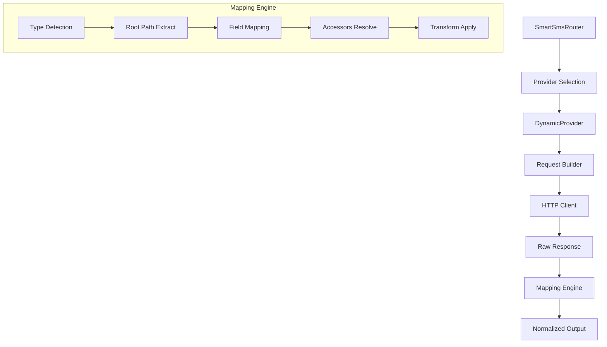
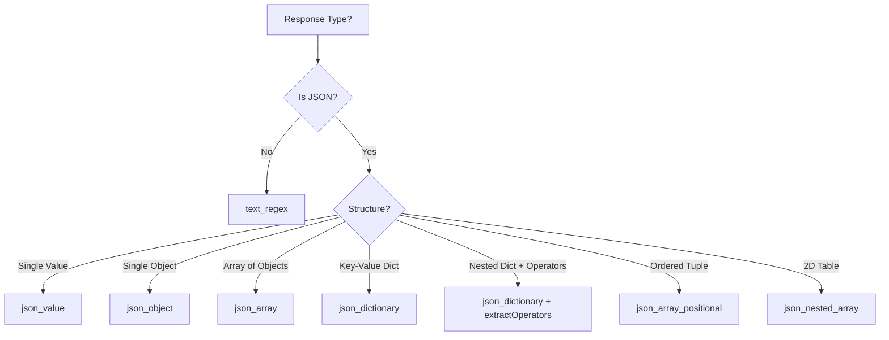

# NexNum Dynamic Provider Engine: Complete Mapping Mechanism

> **Version**: 2.0 (API Standardization)  
> **Last Updated**: January 2026

The **Dynamic Provider Engine** is NexNum's universal adapter for integrating any SMS provider API without writing custom code. This document covers the complete mapping mechanism with all accessors, types, and professional configurations.

---

## Table of Contents
1. [Architecture Overview](#1-architecture-overview)
2. [Endpoint Configuration](#2-endpoint-configuration)
3. [Mapping Types](#3-mapping-types-8-total)
4. [Field Mapping Syntax](#4-field-mapping-syntax)
5. [Special Accessors Reference](#5-special-accessors-reference-30)
6. [Transform Rules](#6-transform-rules)
7. [Response Mapping](#7-response-mapping)
8. [Error Mapping](#8-error-mapping)
9. [Complete Examples](#9-complete-examples)
10. [Professional Recommendations](#10-professional-recommendations)

---

## 1. Architecture Overview



### Standardized Method Names (v2.0)

| Category | Method | Description |
|:---|:---|:---|
| **Inventory** | `getCountriesList` | List available countries |
| **Inventory** | `getServicesList` | List services by country |
| **Inventory** | `getPrices` | Get pricing data |
| **Transaction** | `getNumber` | Purchase activation |
| **Transaction** | `getStatus` | Check SMS status |
| **Transaction** | `getBalance` | Check account balance |
| **Action** | `setCancel` | Cancel activation |
| **Action** | `setResendCode` | Request new SMS |
| **Action** | `setComplete` | Mark activation complete |

---

## 2. Endpoint Configuration

Endpoints define how to connect to each provider API method.

### Structure
```json
{
  "endpoints": {
    "getCountriesList": {
      "method": "GET",
      "path": "/api/countries?key={authKey}",
      "queryParams": { "lang": "en" },
      "headers": { "Accept": "application/json" }
    },
    "getNumber": {
      "method": "POST",
      "path": "/api/purchase",
      "queryParams": {
        "country": "{country}",
        "service": "{service}",
        "maxPrice": "{maxPrice}"
      }
    }
  }
}
```

### Available Placeholders

| Placeholder | Source | Example |
|:---|:---|:---|
| `{authKey}` | Provider API credentials | `abc123xyz` |
| `{country}` | Country code parameter | `us`, `russia` |
| `{service}` | Service code parameter | `whatsapp`, `telegram` |
| `{id}` | Activation ID | `123456789` |
| `{maxPrice}` | Maximum price filter | `0.50` |
| `{operator}` | Network operator | `vodafone` |

---

## 3. Mapping Types (8 Total)

| Type | Use Case | Raw Response Example |
|:---|:---|:---|
| `json_array` | List of objects | `[{"id": 1}, {"id": 2}]` |
| `json_object` | Single object result | `{"balance": 100.50}` |
| `json_dictionary` | Key-value pairs nested | `{"us": {...}, "uk": {...}}` |
| `json_value` | Single primitive value | `100.50` |
| `json_array_positional` | Ordered tuple array | `["123", "+1555", "0.50"]` |
| `json_keyed_value` | ID to value map | `{"123": "pending"}` |
| `json_nested_array` | 2D table structure | `[["id","phone"],["1","+1"]]` |
| `text_regex` | Plain text with regex | `ACCESS_OK:123456:+1555` |

### Type Selection Guide



---

## 4. Field Mapping Syntax

### Basic Path Extraction
```json
"fields": {
  "balance": "data.balance",
  "name": "country_name"
}
```

### Fallback Chains (Try Each Until Found)
```json
"fields": {
  "cost": "price|cost|amount|rate",
  "code": "iso|country_code|id"
}
```

### Literal Defaults
```json
"fields": {
  "operator": "operator|'any'",
  "status": "status|'pending'"
}
```

### Root Path Extraction
```json
{
  "type": "json_array",
  "rootPath": "data.countries",
  "fields": { "code": "id", "name": "title" }
}
```

---

## 5. Special Accessors Reference (30+)

### Context Hierarchy Accessors

Navigate multi-level nested structures automatically.

| Accessor | Returns | Use Case |
|:---|:---|:---|
| `$key` | Current dictionary key | Service code at current level |
| `$parentKey` | Parent level key | Country code one level up |
| `$grandParentKey` | Grandparent level key | Root at 2 levels up |
| `$greatGrandParentKey` | Great-grandparent key | For 4-level nesting |
| `$value` | Current object value | The leaf data |
| `$parentValue` | Parent object value | Parent container |
| `$rootKey` | First-level key | Always country in pricing |
| `$index` | Array element position | `0`, `1`, `2`... |
| `$operatorKey` | Operator/Provider ID | Provider key in nested |

### Depth & Path Accessors

| Accessor | Returns | Output Field? |
|:---|:---|:---|
| `$atDepth:N` | Key at specific depth | ✅ Yes |
| `$depth` | Current nesting level | ❌ Debug only |
| `$isLeaf` | Boolean - no children | ❌ Debug only |
| `$path` | Full dot-path from root | ❌ Debug only |
| `$ancestors` | Array of parent keys | ❌ Debug only |

**Example** - 3-Level Pricing Structure:
```json
"fields": {
  "country": "$atDepth:0",
  "service": "$atDepth:1", 
  "operator": "$atDepth:2|'any'",
  "cost": "price",
  "count": "count"
}
```

### Array Operations

| Accessor | Returns | Example |
|:---|:---|:---|
| `$first` | First element | `arr.$first` |
| `$last` | Last element | `arr.$last` |
| `$length` | Array length | `items.$length` |
| `$values` | All values as array | Object values |
| `$keys` | All keys as array | Object keys |
| `$sum` | Sum of numeric array | Total price |
| `$avg` | Average of array | Average cost |
| `$min` | Minimum value | Lowest price |
| `$max` | Maximum value | Highest price |
| `$unique` | Deduplicated array | Unique codes |
| `$flatten` | Flatten nested arrays | 1D array |
| `$reverse` | Reversed array | Reversed list |
| `$sort` | Sorted array | Alphabetical |
| `$slice:0:5` | Array slice | First 5 items |

### String Operations

| Accessor | Returns | Example |
|:---|:---|:---|
| `$lowercase` | Lowercase string | `CODE` → `code` |
| `$uppercase` | Uppercase string | `code` → `CODE` |
| `$trim` | Trimmed string | Remove whitespace |
| `$split:,` | Split by delimiter | `"a,b"` → `["a","b"]` |
| `$join:,` | Join with delimiter | `["a","b"]` → `"a,b"` |
| `$replace:old:new` | Replace substring | Text replace |
| `$substring:0:5` | Substring extraction | First 5 chars |
| `$padStart:5:0` | Pad start | `42` → `00042` |
| `$padEnd:5:0` | Pad end | `42` → `42000` |

### Type Conversion

| Accessor | Returns | Example |
|:---|:---|:---|
| `$number` | Float value | `"1.5"` → `1.5` |
| `$int` | Integer value | `"42"` → `42` |
| `$float` | Float value | `"1.5"` → `1.5` |
| `$string` | String value | `123` → `"123"` |
| `$boolean` | Boolean value | `"true"` → `true` |
| `$json` | Parsed JSON | String → Object |
| `$stringify` | JSON string | Object → String |

### Conditional Accessors

| Accessor | Returns | Example |
|:---|:---|:---|
| `$default:any` | Default if null/undefined | `field.$default:0` |
| `$ifEmpty:any` | Default if empty string | `name.$ifEmpty:Unknown` |
| `$exists` | Boolean existence check | Validation |

### Metadata Accessors

| Accessor | Returns |
|:---|:---|
| `$firstKey` | First key in object |
| `$firstValue` | First value in object |

---

## 6. Transform Rules

Applied after field extraction to ensure correct output types.

### Configuration
```json
"transform": {
  "cost": "number",
  "count": "number",
  "code": "string",
  "name": "string",
  "operator": "lowercase"
}
```

### Available Transforms

| Transform | Effect | Example |
|:---|:---|:---|
| `number` | Parse to number | `"1.5"` → `1.5` |
| `string` | Convert to string | `123` → `"123"` |
| `boolean` | Convert to boolean | `"true"` → `true` |
| `uppercase` | Uppercase string | `"usa"` → `"USA"` |
| `lowercase` | Lowercase string | `"USA"` → `"usa"` |
| `trim` | Remove whitespace | `" text "` → `"text"` |

---

## 7. Response Mapping

Normalize provider-specific status codes to universal NexNum statuses.

### Configuration
```json
"responseMapping": {
  "statusMapping": {
    "STATUS_OK": "active",
    "STATUS_WAIT_CODE": "pending",
    "STATUS_CANCEL": "cancelled",
    "1": "active",
    "0": "pending",
    "-1": "cancelled"
  }
}
```

### Universal Status Values

| Status | Meaning |
|:---|:---|
| `pending` | Waiting for SMS |
| `active` | SMS received |
| `cancelled` | Activation cancelled |
| `expired` | Activation expired |
| `complete` | Successfully completed |
| `error` | Error state |

---

## 8. Error Mapping

Map provider errors to universal error types for smart routing decisions.

### Configuration
```json
"errorPatterns": [
  {
    "pattern": "NO_NUMBERS",
    "type": "NO_NUMBERS",
    "message": "No numbers available"
  },
  {
    "pattern": "NO_BALANCE",
    "type": "NO_BALANCE",
    "message": "Insufficient balance"
  },
  {
    "pattern": "BAD_KEY|INVALID_API",
    "type": "BAD_KEY",
    "message": "Invalid API credentials"
  }
]
```

### Universal Error Types

| Error Type | Router Action |
|:---|:---|
| `NO_NUMBERS` | Failover to next provider |
| `NO_BALANCE` | Alert admin, disable provider |
| `RATE_LIMITED` | Backoff and retry later |
| `BAD_KEY` | Critical - disable provider |
| `NETWORK_ERROR` | Retry with exponential backoff |

---

## 9. Complete Examples

### Example 1: Simple Countries List

**Provider Response:**
```json
[
  {"id": "us", "name": "United States"},
  {"id": "uk", "name": "United Kingdom"}
]
```

**Mapping Configuration:**
```json
{
  "getCountriesList": {
    "type": "json_array",
    "rootPath": "$",
    "fields": {
      "code": "id",
      "name": "name"
    }
  }
}
```

---

### Example 2: Nested Dictionary (Countries → Services)

**Provider Response:**
```json
{
  "us": {"code": "us", "name": "USA", "count": 150},
  "uk": {"code": "uk", "name": "UK", "count": 80}
}
```

**Mapping Configuration:**
```json
{
  "getCountriesList": {
    "type": "json_dictionary",
    "rootPath": "$",
    "fields": {
      "code": "$key",
      "name": "name",
      "count": "count"
    }
  }
}
```

---

### Example 3: 3-Level Pricing Structure

**Provider Response:**
```json
{
  "russia": {
    "whatsapp": {
      "megafon": {"price": 0.50, "count": 100},
      "mts": {"price": 0.45, "count": 200}
    }
  }
}
```

**Mapping Configuration:**
```json
{
  "getPrices": {
    "type": "json_dictionary",
    "rootPath": "$",
    "fields": {
      "country": "$atDepth:0",
      "service": "$atDepth:1",
      "operator": "$atDepth:2|'any'",
      "cost": "price",
      "count": "count"
    },
    "transform": {
      "cost": "number",
      "count": "number"
    }
  }
}
```

**Mapped Output:**
```json
[
  {"country": "russia", "service": "whatsapp", "operator": "megafon", "cost": 0.50, "count": 100},
  {"country": "russia", "service": "whatsapp", "operator": "mts", "cost": 0.45, "count": 200}
]
```

---

### Example 4: Text Regex Response

**Provider Response:**
```
ACCESS_NUMBER:123456:+15551234567
```

**Mapping Configuration:**
```json
{
  "getNumber": {
    "type": "text_regex",
    "regex": "ACCESS_NUMBER:(\\d+):(\\+?\\d+)",
    "fields": {
      "id": "1",
      "phone": "2"
    }
  }
}
```

---

### Example 5: Nested with extractOperators

**Provider Response:**
```json
{
  "whatsapp": {
    "providers": {
      "11": {"price": 0.50, "count": 100, "provider_id": 11},
      "22": {"price": 0.45, "count": 50, "provider_id": 22}
    }
  }
}
```

**Mapping Configuration:**
```json
{
  "getServicesList": {
    "type": "json_dictionary",
    "rootPath": "$",
    "nestingLevels": {
      "extractOperators": true,
      "providersKey": "providers",
      "requiredField": "provider_id"
    },
    "fields": {
      "service": "$key",
      "operator": "$operatorKey",
      "cost": "price",
      "count": "count"
    }
  }
}
```

---

## 10. Professional Recommendations

### Best Practices

1. **Always use fallback chains** for fields with inconsistent naming:
   ```json
   "cost": "price|cost|amount|rate"
   ```

2. **Always apply transforms** for numeric fields:
   ```json
   "transform": { "cost": "number", "count": "number" }
   ```

3. **Use `$default` for optional fields**:
   ```json
   "operator": "operator.$default:'any'"
   ```

4. **Use `$atDepth:N`** for multi-level structures instead of `nestingLevels`:
   ```json
   "country": "$atDepth:0",
   "service": "$atDepth:1"
   ```

5. **Configure `statusMapping`** for all status endpoints:
   ```json
   "statusMapping": {
     "1": "active",
     "0": "pending",
     "-1": "cancelled"
   }
   ```

### Universal Output Fields

All mappings should produce these canonical field names:

| Endpoint | Required Fields |
|:---|:---|
| `getCountriesList` | `code`, `name` |
| `getServicesList` | `code`, `name` |
| `getPrices` | `cost`, `count`, `country`, `service`, `operator` |
| `getNumber` | `id`, `phone`, `price` |
| `getStatus` | `status`, `code`, `fullSms` |
| `getBalance` | `balance` |
| `setCancel` | `status` |
| `setComplete` | `status` |

---

## Quick Reference Card

```
┌─────────────────────────────────────────────────────────────────┐
│  MAPPING TYPES                                                  │
├─────────────────────────────────────────────────────────────────┤
│  json_array          │  [{ }, { }]                              │
│  json_dictionary     │  { "key": { } }                          │
│  json_object         │  { field: value }                        │
│  text_regex          │  ACCESS_OK:123456                        │
├─────────────────────────────────────────────────────────────────┤
│  CONTEXT ACCESSORS                                              │
├─────────────────────────────────────────────────────────────────┤
│  $key               │  Current dictionary key                   │
│  $parentKey         │  Parent level key                         │
│  $atDepth:N         │  Key at depth N                           │
│  $value             │  Current value                            │
├─────────────────────────────────────────────────────────────────┤
│  FALLBACK SYNTAX                                                │
├─────────────────────────────────────────────────────────────────┤
│  price|cost|amount  │  Try each until found                     │
│  operator|'any'     │  Literal default                          │
│  field.$default:0   │  Default if null                          │
└─────────────────────────────────────────────────────────────────┘
```
